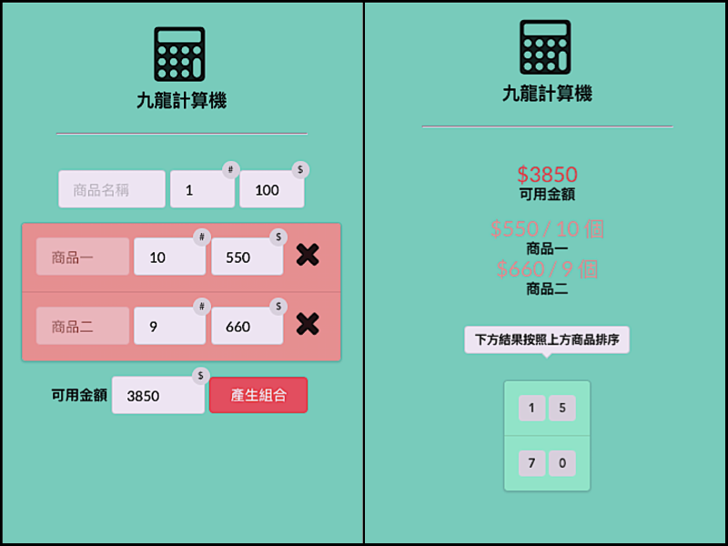

## 九龍計算機

九龍計算機是用來解決小弟幾個在銷售界的朋友常常抱怨的「拆帳」問題，問題的例子是這樣：

> 朋友店內現在有商品一：數量 10 個，一個 550 元；商品二：數量 9 個，一個 660 元。朋友要幫客人湊到 3850 元讓客人買單。請問有幾種買法？

上圖是計算頁面展示，我們可以得到解答在圖的右方：

* `1*550 + 5*660 = 3850`
* `7*550 + 0*660 = 3850`

共兩種！

「九龍」這個名字，來自那位最先告訴我問題的朋友名。

=> [Demo]

[Demo]:https://calculator.yuecen.net/
